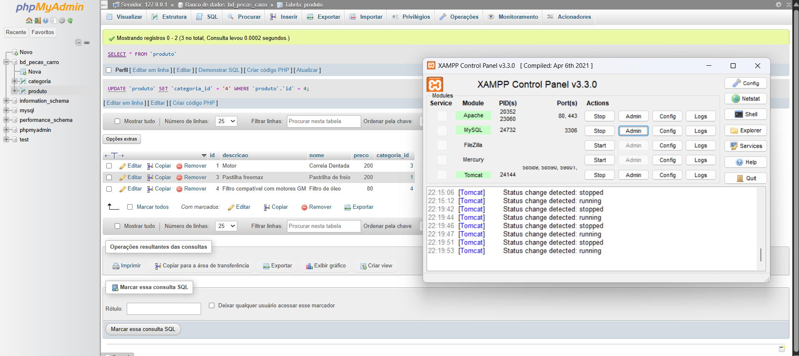

# Projeto Spring Boot: Gerenciamento de Produtos e Categorias

## Objetivo
Este projeto tem como objetivo demonstrar o uso de relacionamento entre entidades em uma aplicação Spring Boot, utilizando MariaDB como banco de dados, juntamente com as bibliotecas Lombok, Spring Web, DevTools e JPA. As entidades utilizadas neste projeto são **Produto** e **Categoria**, com um relacionamento **One-to-Many** (uma categoria possui vários produtos).

## Tecnologias Utilizadas
- Java 17
- Spring Boot
- Spring Web
- Spring Data JPA
- Lombok
- MariaDB
- DevTools
- Maven

## Estrutura do Projeto
- `controller`: Contém os controladores REST (`ProdutoController`, `CategoriaController`).
- `model`: Contém as classes de modelo JPA (`Produto`, `Categoria`).
- `repository`: Contém interfaces que estendem `JpaRepository` para operações de CRUD.
- `resources/application.properties`: Configuração de conexão com o banco de dados MariaDB.
- `LojaApplication.java`: Classe principal que inicia a aplicação.

## Configuração do Ambiente
### 1. Instalação do XAMPP e MariaDB
- Instale o [XAMPP](https://www.apachefriends.org/index.html).
- Abra o XAMPP Control Panel e ative os módulos Apache e MySQL.

### 2. Criação do Banco de Dados
- Clique em "Admin" no módulo MySQL do XAMPP para abrir o phpMyAdmin.
- Crie um banco de dados com o nome `loja`:
```sql
CREATE DATABASE loja;
```
- A imagem abaixo mostra o banco de dados criado especificamente para este projeto:


### 3. Configuração do application.properties
Abra o arquivo `src/main/resources/application.properties` e configure conforme seu ambiente:
```properties
spring.datasource.url=jdbc:mariadb://localhost:3306/loja
spring.datasource.username=root
spring.datasource.password=
spring.jpa.hibernate.ddl-auto=update
spring.jpa.show-sql=true
spring.jpa.properties.hibernate.dialect=org.hibernate.dialect.MariaDBDialect
```

## Como Rodar o Projeto
1. Clone o repositório para sua máquina.
2. Abra o projeto com o **Visual Studio Code (VS Code)**.
3. Navegue até `LojaApplication.java`.
4. Execute a aplicação clicando no botão "Run" ou utilizando o atalho da sua IDE.
5. A aplicação estará rodando em: [http://localhost:8080](http://localhost:8080)

### Para acessar os dados diretamente:
- Produtos: [http://localhost:8080/produtos](http://localhost:8080/produtos)
- Categorias: [http://localhost:8080/categorias](http://localhost:8080/categorias)

## Testando os Endpoints
Utilize uma ferramenta como [Postman](https://www.postman.com/) ou [Bruno](https://www.usebruno.com/) para testar os endpoints.

### Endpoints para Categoria
- `GET /categorias`: Lista todas as categorias.
- `POST /categorias`: Cria uma nova categoria.
- `PUT /categorias/{id}`: Atualiza uma categoria existente.
- `DELETE /categorias/{id}`: Deleta uma categoria.

### Endpoints para Produto
- `GET /produtos`: Lista todos os produtos.
- `POST /produtos`: Cria um novo produto.
- `PUT /produtos/{id}`: Atualiza um produto existente.
- `DELETE /produtos/{id}`: Deleta um produto.

## Relacionamento Entre Entidades
- A classe `Categoria` possui uma lista de produtos anotada com `@OneToMany`.
- A classe `Produto` referencia `Categoria` com `@ManyToOne`.
- O relacionamento está corretamente mapeado e persistido no banco de dados MariaDB.


